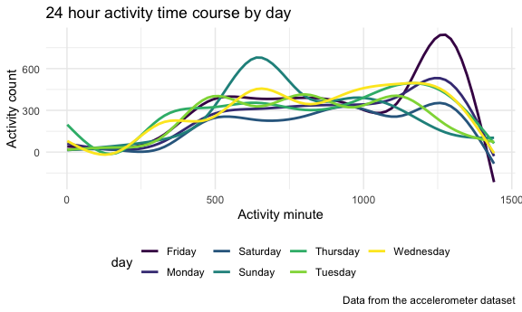

P8105 Homework 3 Solutions
================
Meghan Bellerose
October 1, 2020

``` r
library(tidyverse)
library(lubridate)
library(ggridges)
library(patchwork)

knitr::opts_chunk$set(
  fig.width = 6,
  fig.asp = .6,
  out.width = "90%"
)

theme_set(theme_minimal() + theme(legend.position = "bottom"))

options(
  ggplot2.continuous.colour = "viridis",
  ggplot2.continuous.fill = "viridis"
)

scale_colour_discrete = scale_colour_viridis_d
scale_fill_discrete = scale_fill_viridis_d
```

# Problem 1: Instacart

First, I’ll load Instacart data from the p8105 library.

``` r
library(p8105.datasets)
data("instacart")
```

The Instacart dataset includes 1384617 rows and 15 columns. Observations
are the level of items in order by user. There are user order variables,
including user ID, order ID, order day, and order hour. There are also
item variables, including name, aisle, department, and some numeric
codes.

``` r
instacart %>% 
  count(aisle) %>% 
  arrange(desc(n))
```

    ## # A tibble: 134 x 2
    ##    aisle                              n
    ##    <chr>                          <int>
    ##  1 fresh vegetables              150609
    ##  2 fresh fruits                  150473
    ##  3 packaged vegetables fruits     78493
    ##  4 yogurt                         55240
    ##  5 packaged cheese                41699
    ##  6 water seltzer sparkling water  36617
    ##  7 milk                           32644
    ##  8 chips pretzels                 31269
    ##  9 soy lactosefree                26240
    ## 10 bread                          23635
    ## # … with 124 more rows

There are 134 aisles. The aisles that most items are ordered from are
fresh vegetables, fresh fruits, and packaged vegetables and fruits.

The following plot shows the number of items ordered in each aisle
(limited to aisles with more than 1000 items ordered).

``` r
instacart %>% 
  count(aisle) %>% 
  filter(n > 10000) %>% 
  mutate(
    aisle = factor(aisle),
    aisle = fct_reorder(aisle, n)
  ) %>% 
  ggplot(aes(x = aisle, y = n)) +
  geom_point() +
  theme(axis.text.x = element_text(angle = 90, vjust = 0.5, hjust = 1))
```


This table shows the three most popular items in the aisles: “baking
ingredients”, “dog food care”, and “packaged vegetables fruits” and how
many times each item is ordered.

``` r
instacart %>% 
  filter(aisle %in% c("baking ingredients", "dog food care", "packaged vegetables fruits")) %>% 
  group_by(aisle) %>% 
  count(product_name) %>% 
  mutate(rank = min_rank(desc(n))) %>% 
  filter(rank < 4) %>% 
  arrange(aisle, rank) %>% 
  knitr::kable()
```

| aisle                      | product\_name                                 |    n | rank |
| :------------------------- | :-------------------------------------------- | ---: | ---: |
| baking ingredients         | Light Brown Sugar                             |  499 |    1 |
| baking ingredients         | Pure Baking Soda                              |  387 |    2 |
| baking ingredients         | Cane Sugar                                    |  336 |    3 |
| dog food care              | Snack Sticks Chicken & Rice Recipe Dog Treats |   30 |    1 |
| dog food care              | Organix Chicken & Brown Rice Recipe           |   28 |    2 |
| dog food care              | Small Dog Biscuits                            |   26 |    3 |
| packaged vegetables fruits | Organic Baby Spinach                          | 9784 |    1 |
| packaged vegetables fruits | Organic Raspberries                           | 5546 |    2 |
| packaged vegetables fruits | Organic Blueberries                           | 4966 |    3 |

This table shows the mean hour of the day at which Pink Lady Apples and
Coffee Ice Cream are ordered on each day of the week.

``` r
instacart %>% 
  filter(product_name %in% c("Pink Lady Apples", "Coffee Ice Cream")) %>% 
  group_by(product_name, order_dow) %>% 
  summarize(mean_hour= mean(order_hour_of_day)) %>% 
  pivot_wider(
    names_from = order_dow,
    values_from = mean_hour
  ) %>% 
  knitr::kable()
```

    ## `summarise()` regrouping output by 'product_name' (override with `.groups` argument)

| product\_name    |        0 |        1 |        2 |        3 |        4 |        5 |        6 |
| :--------------- | -------: | -------: | -------: | -------: | -------: | -------: | -------: |
| Coffee Ice Cream | 13.77419 | 14.31579 | 15.38095 | 15.31818 | 15.21739 | 12.26316 | 13.83333 |
| Pink Lady Apples | 13.44118 | 11.36000 | 11.70213 | 14.25000 | 11.55172 | 12.78431 | 11.93750 |

# Problem 2: Accelerometers

This problem includes data from an accelerometer dataset including five
weeks of accelerometer data collected on a 63 year-old male with a BMI
of 25 who was admitted to the Advanced Cardiac Care Center of Columbia
University Medical Center and diagnosed with congestive heart failure
(CHF).

First, I will load, tidy, and organize the data.

``` r
accel_data = 
  read_csv("./data/accel_data.csv") %>% 
  pivot_longer(
    activity.1:activity.1440,
    names_to = "minute", 
    names_prefix = "activity.",
    values_to = "activity_count") %>% 
  group_by(day) %>% 
  mutate( 
    minute = as.numeric(minute),
    weekend = day,
    weekend = recode(weekend, "Monday" = "FALSE", "Tuesday" = "FALSE", "Wednesday" = "FALSE", "Thursday" = "FALSE", "Friday" = "FALSE", "Saturday" = "TRUE", "Sunday" = "TRUE"),
    weekend = as.logical(weekend)
  ) 
```

    ## Parsed with column specification:
    ## cols(
    ##   .default = col_double(),
    ##   day = col_character()
    ## )

    ## See spec(...) for full column specifications.

``` r
head(arrange(accel_data, day_id, week, day, weekend, minute, activity_count))
```

    ## # A tibble: 6 x 6
    ## # Groups:   day [1]
    ##    week day_id day    minute activity_count weekend
    ##   <dbl>  <dbl> <chr>   <dbl>          <dbl> <lgl>  
    ## 1     1      1 Friday      1           88.4 FALSE  
    ## 2     1      1 Friday      2           82.2 FALSE  
    ## 3     1      1 Friday      3           64.4 FALSE  
    ## 4     1      1 Friday      4           70.0 FALSE  
    ## 5     1      1 Friday      5           75.0 FALSE  
    ## 6     1      1 Friday      6           66.3 FALSE

The final accelerometer dataset contains information on the day and week
of activity collection, whether the data were collected on a weekend or
weekday, and the activity count during each minute of the 24 hour days.
Overall, the mean activity count per minute during the 5 week
observation period was 267. The dataset has 50400 rows and 6 columns.

I’ll now create a dataset aggregating activity counts over each day and
produce a table showing the totals.

    ## `summarise()` ungrouping output (override with `.groups` argument)

| day       | activity\_total |
| :-------- | --------------: |
| Monday    |         1858699 |
| Tuesday   |         1799238 |
| Wednesday |         2129772 |
| Thursday  |         2091151 |
| Friday    |         2291711 |
| Saturday  |         1369237 |
| Sunday    |         1919213 |

The table shows that total activity is highest on Friday and lowest on
Saturday. It seems that the man typically had a higher activity day
every other day of the week.

Now I’ll make a plot showing the 24 hour activity time course for each
day with activity minute on the x axis and activity count on the y axis.

``` r
accel_data %>% 
  group_by(day) %>%
  ggplot(aes(x = minute, y = activity_count, color = day)) + 
    geom_smooth(se = FALSE) +
    labs(
      title = "24 hour activity time course by day",
      x = "Activity minute",
      y = "Activity count",
      caption = "Data from the accelerometer dataset"
  ) 
```

    ## `geom_smooth()` using method = 'gam' and formula 'y ~ s(x, bs = "cs")'



The plot shows that the man from whom accelerometer data was collected
slept during the night (minutes 0-250 and 1375-1500 corresponding to
11pm-4am) and was active during the day. The biggest spurts of activity
were typically late Sunday monring and late Friday night.

# Problem 3

First, I’ll load NY NOAA data from the p8105 library.

``` r
library(p8105.datasets)
data("ny_noaa")
```

This dataset comes from the National Oceanic and Atmospheric Association
(NOAA) National Climatic Data Center. It includes information on all New
York State weather stations from January 1, 1981 to December 21, 2010,
including the weather station id (id), date of observation,
precipitation in tenths of mm (prcp), snowfall in mm (snow), snow depth
in mm (snwd), maximum and minimum temperature in degrees C (tmax)
(tmin).

Prior to cleaning, the dataset had 2595176 rows and 7 columns. Since
each station collects only a subset of the variables described, the
dataset has a lot of missing data.

I will now clean and tidy the dataset and switch the units to reasonable
ones.

``` r
ny_noaa = ny_noaa %>% 
  mutate(date = ymd(date)) %>% 
  mutate_at(vars(date), funs(year, month, day))
```

    ## Warning: `funs()` is deprecated as of dplyr 0.8.0.
    ## Please use a list of either functions or lambdas: 
    ## 
    ##   # Simple named list: 
    ##   list(mean = mean, median = median)
    ## 
    ##   # Auto named with `tibble::lst()`: 
    ##   tibble::lst(mean, median)
    ## 
    ##   # Using lambdas
    ##   list(~ mean(., trim = .2), ~ median(., na.rm = TRUE))
    ## This warning is displayed once every 8 hours.
    ## Call `lifecycle::last_warnings()` to see where this warning was generated.
